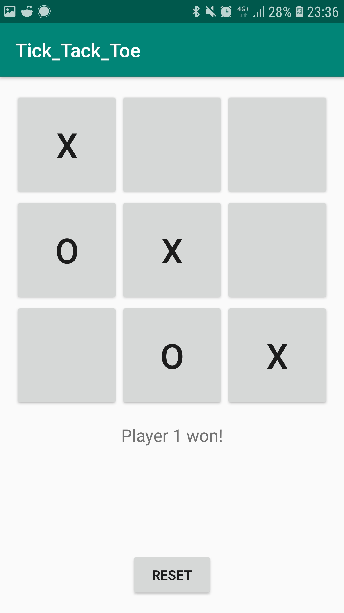
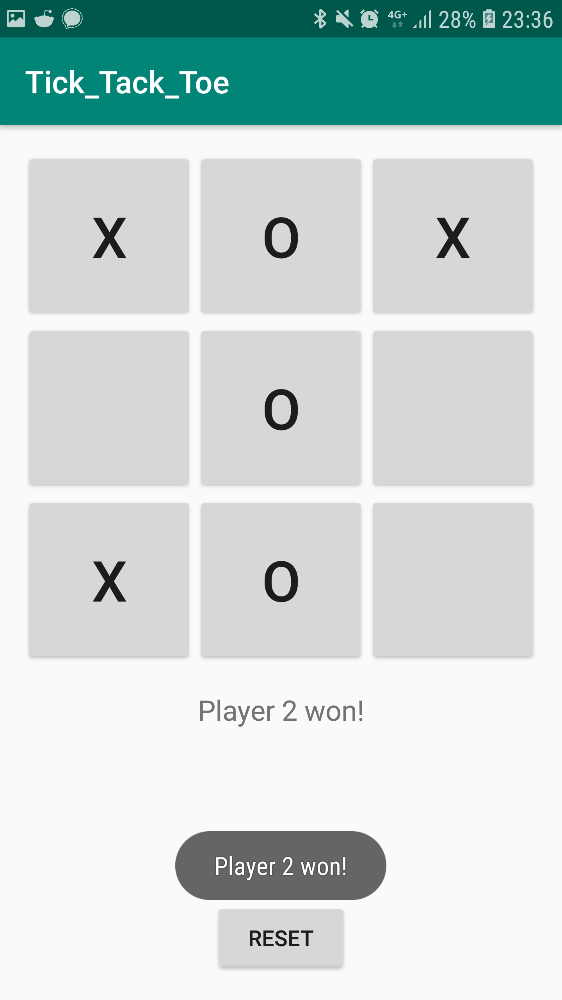
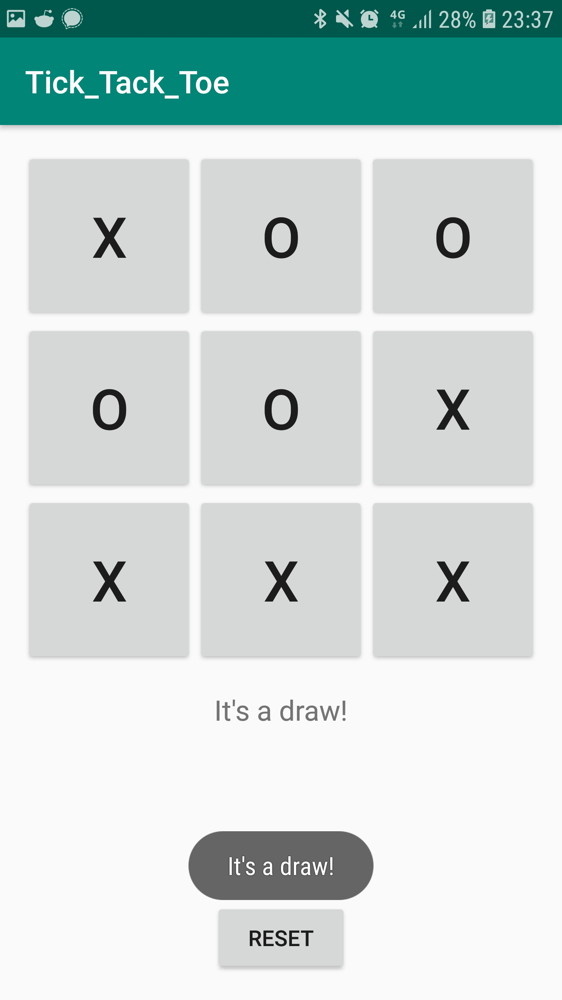
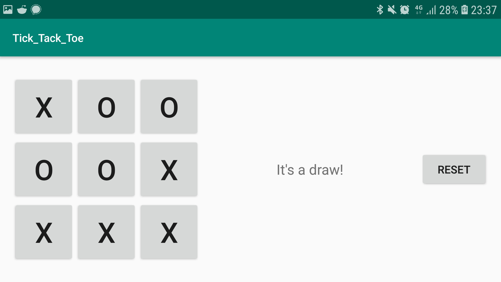

# TickTackToe

This app simulates the popular game Tic-Tac-Toe!

Whoever has 3 in a row first wins, after which the game is over.

The first player is X and the second player is O. It also has a reset button when you want to play some more.

  

